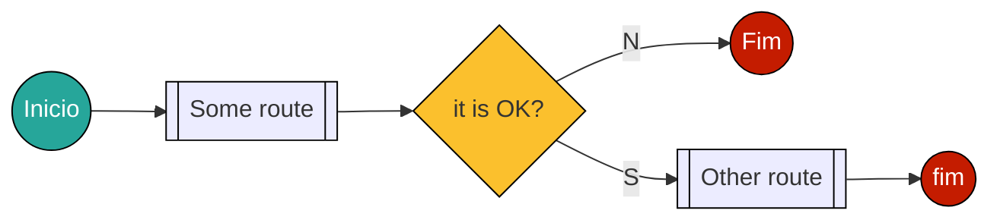

```mermaid
graph LR
classDef finish fill:#c41c00,color:white,stroke:black;
classDef default stroke:black;
classDef if fill:#fbc02d,stroke:black;
style start fill:#26a69a,color:white;

start((Inicio))
-->someRoute[[Some route]]
-->returnSomeRoute{it is OK?}:::if
--> |N|finish1((Fim)):::finish;

returnSomeRoute
--> |S|otherRoute[[Other route]]
-->finishGetFreight((fim)):::finish;

click otherRoute "/flow/other-doc"
```