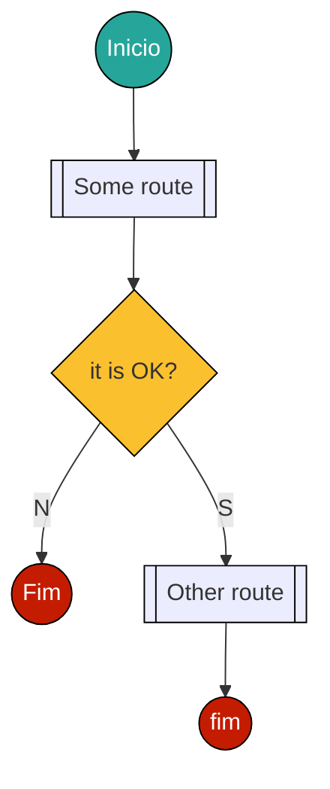

# Some doc
## some subtitle
Lorem ipsum dolor sit amet, consectetur adipiscing elit. Vivamus nec ornare nulla, eget interdum nibh. Duis tortor purus, scelerisque non mattis ac, euismod et nunc. Aliquam a ultrices mauris, eget rutrum ante. Donec vestibulum leo eget elit condimentum pulvinar. Aenean id metus eget sem accumsan pellentesque a et elit. Ut non ipsum dolor. Aliquam varius sem in lectus molestie, ac feugiat nulla vestibulum. Ut non augue in dolor tristique malesuada. Duis condimentum finibus justo, at posuere eros vehicula sit amet. Sed odio nulla, semper commodo tincidunt vitae, cursus a lorem. In hac habitasse platea dictumst. Donec aliquet metus ut nulla lacinia egestas. Nulla faucibus aliquam ante nec ultricies. Suspendisse eget lectus cursus, suscipit enim eget, malesuada nisi. Aenean et finibus dui, vitae sagittis diam. Donec dictum iaculis porta.

